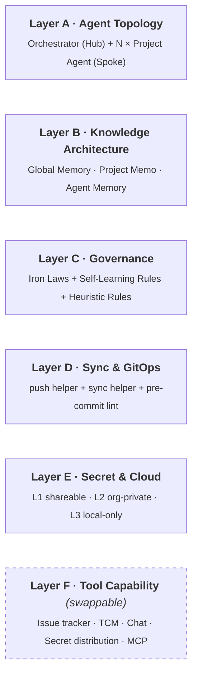
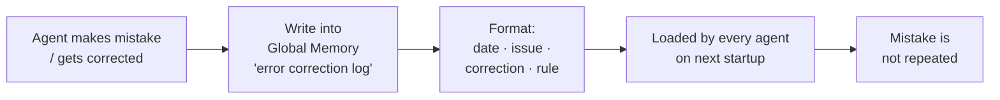

# QA Agent Operating Framework


**Languages**: English · [繁體中文](./README.zh-TW.md)

> [!TIP]
> **30-second version**
> - **Problem**: AI Agents helping with QA tend to drift, overwrite each other, and leak secrets at scale.
> - **Approach**: Six concerns to answer — Topology · Knowledge · Governance · Sync · Secret · Tool.
> - **For**: solo QA, small teams, anyone with a working PoC that needs to scale.
> - **Not**: a tool, not an MCP — a set of conventions above your LLM / IDE.

> [!NOTE]
> This framework documents general architectural patterns for operating AI Agents in QA workflows. It is not derived from, nor does it represent, any specific organization's proprietary systems or trade secrets. All examples are illustrative.

A platform-layer playbook for running QA work with multiple AI Agents — for anyone scaling AI-assisted QA past the first proof-of-concept, whether solo, in a small team, or inside a larger org.

It is not a tool. It is not an MCP. It is a **set of conventions, structures, and guardrails** that sit *above* whichever LLM / IDE / framework you happen to use, so that your QA Agents can collaborate without the usual failure modes (forgetting, conflicting writes, leaked secrets, vendor lock-in).

If you have already started thinking *"I think I need more than just better prompts"*, this is for you.

---

## Contents

- [What this is](#what-this-is)
- [Who this is for](#who-this-is-for)
- [When NOT to use this framework](#when-not-to-use-this-framework)
- [Why a framework, not just better prompts](#why-a-framework-not-just-better-prompts)
- [Architecture overview](#architecture-overview)
- [Layer A — Agent Topology](#layer-a--agent-topology)
- [Layer B — Knowledge Architecture](#layer-b--knowledge-architecture)
- [Layer C — Governance](#layer-c--governance)
- [Layer D — Sync & GitOps](#layer-d--sync--gitops)
- [Layer E — Secret & Cloud](#layer-e--secret--cloud)
- [Layer F — Tool Capability](#layer-f--tool-capability)
- [How to adopt this](#how-to-adopt-this)
- [Adoption path for solo practitioners](#adoption-path-for-solo-practitioners)
- [Glossary](#glossary)
- [FAQ](#faq)
- [Status & contributing](#status--contributing)
- [License & author](#license--author)

> [!TIP]
> **First time here?** Read in this order: *Who this is for* → *Architecture overview* → *Layer A / B / C* → *How to adopt this*. Skip D / E / F until you actually need them.

---

## What this is

This framework is the result of my own attempt to scale AI-assisted QA beyond prompt engineering. It is the structure that emerged after stress-testing AI Agents across parallel product environments — and falling into every avoidable pit along the way: shared memory polluted by ticket numbers, agents stepping on each other's commits, secrets that almost got committed to public repos, and the same mistakes repeated across sessions because nothing had been written down at the right level.

It addresses **how to operate AI Agents at scale**, not how to write prompts or call APIs. The actual prompts, models, and tools change every quarter. The patterns described here have held up across all of them.

The framework is opinionated. Each decision below has a corresponding failure that pushed it into existence.

Treat the layer names that follow as **categories of concern, not components to copy**. Your answer to each may look nothing like mine — what matters is that you have an answer for each.

---

## Who this is for

Three kinds of readers:

- **Solo QA engineers** who have moved past "just write better prompts" and now need structure to keep their AI workflow from drifting.
- **Small teams** wanting to avoid the classic multi-agent failure mode — agents overwriting each other's work, polluting shared memory, or leaking secrets.
- **Anyone with a working PoC** who needs to extend it from one product to several without the whole thing collapsing under its own weight.

If none of those sound like you, the framework may be overkill. See the next section.

---

## When NOT to use this framework

> [!CAUTION]
> Be honest about the trade-off. Skip this framework if:
>
> - You have **one product and one agent** only — three memory tiers and a Hub-and-Spoke topology will slow you down with no payoff.
> - You run **one-off test sessions** that don't need persistent memory across runs.
> - You already have a **mature internal QA agent platform** — adopting these conventions on top will fight against your existing structure rather than complement it.

The framework solves real coordination problems. If those problems don't exist in your context yet, this is premature optimization.

---

## Why a framework, not just better prompts

Five recurring pains drove five design choices:

| Pain | Design choice |
|------|---------------|
| The same mistake repeats across sessions | **Rules live in the startup script, not just the prompt.** Prompts get truncated; startup logic does not. |
| Lessons learned by one agent never reach the next | **Errors are captured as self-learning rules**, written into a memory layer every agent reads on boot. |
| Multiple agents editing shared framework code tend to create merge churn | **Project agents have read-only access to the shared framework.** All cross-project changes go through one orchestrator. |
| Need to share architecture publicly, but internal config / credentials must never leak | **Three-tier Git layout: framework / configuration / secrets**, with mechanical separation enforced by pre-commit hooks. |
| Avoid lock-in to a single LLM / IDE provider | **AI-platform neutrality** — every assumption that would only run on Claude / Cursor / Codex is isolated into the tool capability layer. |

These were not designed up-front. They are the residue of recovering from each pain point.

---

## Architecture overview



Layers A through E are the framework. Layer F is the implementation surface where MCP, internal CLIs, and tool integrations live. The framework deliberately treats Layer F as **swappable**.

---

## Layer A — Agent Topology

A single Hub-and-Spoke arrangement:

- **Orchestrator Agent** at the top — cross-product visibility, framework upgrades, rule authorship, sync between projects.
- **N × Project Agent** below — one per product line, each scoped to its own product. Executes tests, writes reports, raises tickets. Has read-only access to the shared framework.

Considered alternatives:

- **A single agent covering all products.** Fails on context size as soon as you cross a handful of products, and a single bad action affects every product simultaneously.
- **A flat peer-to-peer multi-agent topology.** No single owner for cross-product rules; responsibility boundaries blur and decisions stall.

Hub-and-Spoke wins because it gives one entry point for cross-product change, clear ownership, and a bounded context window per agent.

**Hard constraint:** Project Agents may not modify the shared framework. All cross-product changes must originate from the Orchestrator.

### In practice: how Hub-and-Spoke gets enforced

In the reference implementation, each agent is simply a separate AI tool CLI session opened in a different directory:

- A session opened at the **framework root** acts as the Orchestrator.
- A session opened inside a **product folder** (after `cd`-ing in) acts as that product's Project Agent.

The topology is enforced by **where the session is opened**, plus per-directory instruction files (`CLAUDE.md` / `AGENTS.md` / `GEMINI.md`, depending on your AI tool) that scope the session's role. No daemon, no special routing — the file system *is* the routing.

---

## Layer B — Knowledge Architecture

Three memory tiers with strictly different lifetimes and write permissions:

| Tier | Example content | Lifetime | Write permission |
|------|-----------------|----------|------------------|
| **Global Memory** | Iron laws, self-learning rules, cross-product decisions | Year+ | Orchestrator only |
| **Project Memo** | Product environments, test accounts, TCM configuration | Months | Orchestrator + Project Agent (whitelist sections only) |
| **Agent Memory** | Single-test results, ticket-by-ticket investigations | Day / ticket | The Project Agent only |

### Three questions before writing

Before writing into memory, an agent must answer:

1. Will this still matter in a month?
2. Would another project's agent benefit from seeing it?
3. Is it bound to a single ticket number?

Any "no" routes the write to Agent Memory, not Global or Project.

### Engineering protections

Prompt-level reminders are not enough. The reference implementation uses **four concentric layers of guard**:

1. **Rules layer.** Whitelist sections in Project Memo (what content is allowed where), forbidden patterns (ticket numbers, internal product codes), and the three questions above — any write must clear this layer first.
2. **Permission layer.** Your AI tool's local settings file (e.g., `.claude/settings.local.json`) uses `deny` rules to block direct `Write` / `Edit` on protected paths (Global Memory, Project Memo, shared scripts, shared templates). These deny rules are themselves *pushed down from the Orchestrator* to each Project Agent's repo — Project Agents cannot relax their own permissions.
3. **Tool layer.** A dedicated writer (illustratively named `safe-memo-writer.py`) is the **only sanctioned write path** for Project Memo. It runs section-whitelist checks, forbidden-pattern regex, and a diff confirmation before saving.
4. **Audit layer.** A `pre-commit` hook lints memory files locally on every commit; the push helper re-runs the same lint before pushing to L2.

Each layer alone is insufficient. Together, they make memory pollution a multi-step failure rather than a single-step accident.

---

## Layer C — Governance

Three concentric rule sets with **decreasing rigidity**:

```
Iron Laws            Fixed core    Never violated. Highest priority.
                                   Example: all commits / pushes require
                                   explicit user consent in writing before
                                   --go.

Self-Learning Rules  Growing log   Derived from past mistakes. Always loaded
                                   on agent startup.
                                   Example: a TCM tool's stats engine only
                                   counts a subset of the enum values its API
                                   accepts — verify against the actual stats
                                   backend, not just the API response.

Heuristic Rules      Preferences   Preference defaults that context can
                                   override.
                                   Example: opening an issue-tracker bug
                                   should trigger the bug-report skill.
```

### The error-self-learning loop

The single most important behavior in this framework is the loop that turns a mistake into a permanent rule:



Without this loop, an individual's experience never becomes the team's knowledge.

---

## Layer D — Sync & GitOps

When the framework is consumed by multiple Project Agents living in separate repos, the most common bug is: *"Someone updated the shared library, several product copies did not, the rest tripped over the divergence weeks later."*

Three tools address this. *Names below are illustrative — adopt your own conventions.*

- **`push-helper.py`** — Cross-tier push helper. Categorizes every changed file into `L1 / L2 / DUAL / PROJECT / SKIP / SECRET`. Aborts immediately if it detects sensitive strings — even before dry-run.
- **`sync-scripts.py`** — Propagates business-script changes across product copies. Runs as a pre-push check.
- **Pre-commit hooks** — Run lint locally on every commit. A Project Memo containing a ticket number is rejected at this gate, not at code review.

### Push confirmation contract (Iron Law 1)

```
Step 1: Agent runs --dry-run, analyzes the diff
Step 2: Explains the changes (repo / files / summary) to the user in writing
Step 3: Receives explicit consent
Step 4: --go executes the push
Step 5: Reports back the commit hash
```

Without this contract, an autonomous push can trigger a costly rollback — the kind of incident this rule is designed to prevent.

---

## Layer E — Secret & Cloud

### Workspace layout

The three layers live as **sibling directories**, each its own git repository:

```
your-workspace/
├── qa-agent-framework/   ← L1 · framework + orchestrator code · shareable
├── qa-agent-config/      ← L2 · org-private config + project memos
└── {project}/            ← N × project repos, each its own git
```

Cross-layer changes flow through explicit sync helpers (see Layer D). The project repos at the bottom row are wherever your codebase lives; they are not children of the framework directory.

### Three-tier repository separation

```
L1: qa-agent-framework        (shareable; what you are reading)
    ├ Framework documentation
    ├ Skill templates
    └ Generic governance rules
       ↑ Fully scrubbed of any organization-specific content

L2: qa-agent-config           (org-private)
    ├ org-config.yml (product names, Board IDs, domains)
    ├ Project memos
    └ Progress logs
       ↑ Contains organization-specific configuration

L3: Local-only                (never committed)
    ├ credentials.local
    ├ token JSON
    └ OAuth credentials
       ↑ .gitignore + pre-commit hooks as dual protection
```

The intent: the same framework can be adopted by multiple organizations with only their own L2 configuration differing. L1 is shareable, L2 stays private to each organization, L3 never leaves the operator's machine.

### Cloud execution extension

For teams running tests on CI rather than local machines, the framework expects this pattern:

```
Service Account → Google Drive (or equivalent) → age-encrypted blobs
         │
         ▼
   Server cron pulls and decrypts into local cache (TTL'd)
         │
         ▼
   Test execution (GitLab CI / Playwright / etc.)
         │
         ▼
   Three-channel result reporting: TCM / Markdown repo / Chat
         │
         ▼
   Failure traces uploaded to Drive, auto-rotated after N days
```

Secrets are encrypted in transit and at rest, local caches expire, and failure traces are rotated. If a machine is compromised or a person leaves, the surface area to clean up is small and bounded.

---

## Layer F — Tool Capability

*The tools below are one reference implementation. Substitute equivalents in your stack — the framework is platform-neutral.*

The current implementation uses internal Python CLIs because they compose freely and are easy to extend:

- **Issue tracker integration** (e.g., Jira) — Pull tickets, list "awaiting QA", file test sub-tickets.
- **TCM integration** (e.g., MeterSphere or any open-source / commercial test case management tool) — Plan creation, case linkage, result writeback (including step-level), screenshot upload, batch update.
- **Chat notifications** (e.g., Slack) — Webhook-driven weekly summaries and failure alerts. (No custom bot; webhooks have proven low-maintenance.)
- **Secret distribution via cloud storage** (e.g., Google Drive) — Service Account + age encryption.
- **Report repository** — All product test reports stored as Markdown in a unified repo.

**MCP fits this layer**, but it is not a replacement for the framework. The core value lives in Layers A through E. MCP is one of several wire protocols Layer F can speak.

### Failure cases already captured as rules

A few representative patterns, distilled into self-learning rules:

- A TCM tool's status enum mismatch between API contract and stats engine — the API accepts multiple values, but the stats backend only counts a subset. Verify against the actual stats backend, not the API response.
- TCM UI displaying stale state due to client-side cache, where no corresponding backend field exists.
- Issue-tracker comment body in a structured format (e.g., ADF) flattening differently from UI rendering.
- Self-hosted chat bots tend to have higher maintenance cost than reusing existing webhooks.

These live in Global Memory's error-correction log. Every agent loads them on startup.

---

## How to adopt this

This framework is a **starting point**, not a turnkey kit. Adapting it well takes a few weeks. A minimal adoption path:

### Week 1 — Skeleton

1. Create three Git repos following the L1 / L2 / L3 layout (L1 can be a fork of this one, L2 starts empty, L3 lives in your home directory).
2. Pick one Project Agent. Do not try to set up the Orchestrator first — get one project working end-to-end before generalizing.
3. Define your **first three iron laws** in Global Memory. Push confirmation is almost always one of them.

### Week 2 — Loop

1. Pick a real workflow: a Jira ticket entering "to QA". Wire the loop end-to-end through one Project Agent. It does not have to be elegant.
2. Each mistake the agent makes during the week becomes a self-learning rule. Aim for around ten by end of week.
3. Resist the temptation to add more agents. One working loop is worth more than three half-working ones.

### Week 3 — Multiply

1. Introduce the Orchestrator only when you have **a second product** to bring online.
2. Copy the working Project Agent, scope it to the new product. Use `sync-scripts.py` or your equivalent.
3. Move any rule that turned out to be cross-product into Global Memory.

### What does *not* work

> [!WARNING]
> - Setting up all six layers from day one and expecting them to slot together.
> - Reading this document and then writing prompts.
> - Skipping Layer E ("we'll add secrets handling later"). Almost-secrets get committed eventually if there is no infrastructure to prevent it.

---

## Adoption path for solo practitioners

If you are working alone, the framework still applies — it just scales down:

- **Hub-and-Spoke can be simulated with sessions or personas.** You do not need separate agents; you need separate scopes. Open one session as the Orchestrator (cross-product work), and another as the Project Agent (one product at a time).
- **L2 can collapse to a single private folder.** No separate org-config repo until you have multiple machines or contributors.
- **Start with one Iron Law.** Push confirmation is usually enough on day one. Add the next law only when you have felt the pain that motivates it.
- **Skip the Orchestrator until you have a second product.** A single Project Agent with good memory hygiene already captures most of the value.

The framework scales down. The discipline does not.

---

## Glossary

- **Orchestrator Agent** — Top-level agent with cross-product visibility. Owns framework upgrades, rule authorship, and cross-project synchronization.
- **Project Agent** — Scoped to a single product line. Executes tests, writes reports, raises tickets. Read-only access to the shared framework.
- **Hub-and-Spoke** — Topology where one Orchestrator (hub) coordinates N Project Agents (spokes). Avoids both single-agent context overflow and peer-to-peer ambiguity.
- **Memory Tier** — One of three persistence layers (Global / Project / Agent), each with different lifetime and write permissions.
- **Memory pollution** — When short-lived ticket-bound details leak into long-lived shared memory, gradually eroding its signal-to-noise ratio. The primary failure mode that Layer B is designed to prevent.
- **Iron Law** — A rule that is never violated under any circumstance. Highest priority in the governance stack.
- **Self-Learning Rule** — A rule derived from a past mistake, automatically loaded by every agent on startup.
- **L1 / L2 / L3 separation** — Three-tier Git layout: L1 is the shareable framework, L2 is org-private configuration, L3 is local-only secrets.
- **TCM** — Test Case Management tool (e.g., MeterSphere, TestRail, Zephyr, Xray).
- **MCP** — Model Context Protocol. A wire protocol for AI agents to call external tools. In this framework, MCP lives inside Layer F as one of several possible adapters.

---

## FAQ

**Q: Why Hub-and-Spoke instead of peer-to-peer?**
Peer-to-peer multi-agent setups have no single owner for cross-product rules. Responsibility boundaries blur and decisions stall. Hub-and-Spoke gives one entry point for cross-product change, clear ownership, and a bounded context window per agent.

**Q: Why three memory tiers, not two?**
Two tiers collapse "lasts a month" and "lasts a year" into the same place — which is exactly how cross-product knowledge gets polluted by single-ticket details. Three tiers force the writer to decide which lifetime the memory deserves before it ever hits disk.

**Q: Can I use this with Claude Code / Cursor / Codex / something else?**
Yes. The framework is platform-neutral. Anything platform-specific (settings files, hook syntax, MCP wiring) is isolated to Layer F. Swap Layer F to match your stack.

**Q: How is this different from just using MCP?**
MCP is a wire protocol — it tells your agent how to call tools. This framework is everything above that: who can call which tool, what memory the call writes to, what rules govern the call, and how multiple agents coordinate. MCP lives inside Layer F; the rest of the framework wraps around it.

---

## Status & contributing

This framework has been stress-tested in real-world QA workflows and continues to evolve. Issues and discussions are welcome — especially:

- Concrete failure modes you have hit that are not represented here.
- Adoption notes from your own context, with as much detail as you can share.
- Translations or English-language refinements.

See [CONTRIBUTING.md](./CONTRIBUTING.md) for what kinds of changes are accepted. Pull requests for the framework itself are accepted but slow — the goal is to keep the document accurate to lived experience rather than to grow it indefinitely.

---

## License & author

This documentation is licensed under [Creative Commons Attribution 4.0 International](./LICENSE) (CC BY 4.0). You may share and adapt the material for any purpose, including commercial use, provided you give appropriate credit and indicate if changes were made.

Author: [Williams Liu](https://me.twilliamstech.com) · QA Engineer × AI Workflow Architect.

A longer-form narrative version (with personal context and dated mistakes) is available as the [case-study blog post](https://me.twilliamstech.com/blog/qa-agent-framework/).
