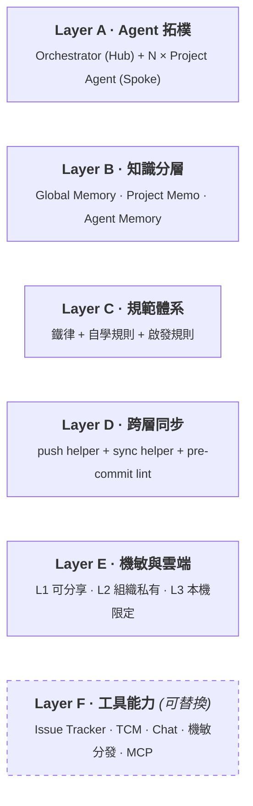
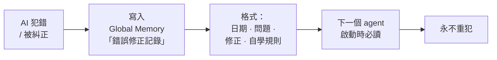

# QA Agent Operating Framework


**語言**：[English](./README.md) · 繁體中文

> [!TIP]
> **30 秒版**
> - **問題**：AI Agent 協助 QA 工作，規模化後容易飄、互相覆寫、洩漏機敏
> - **解法**：六個需要回答的關注點 — 拓樸 · 知識 · 規範 · 同步 · 機敏 · 工具
> - **適合**：獨立 QA、小團隊、已有 PoC 想擴展的人
> - **不是**：工具、不是 MCP — 是 LLM / IDE 之上的一組慣例

> [!NOTE]
> 這份文件描述的是操作 AI Agent 進行 QA 工作的通用架構模式。不衍生自、也不代表任何特定組織的內部系統或商業機密。所有範例僅為示意。

一套**平台層**的工作流規範，用來在 AI Agent 協作環境下做 QA — 寫給任何想把 AI 驅動 QA 從 PoC 階段往上推的人，不論你是個人、小團隊、還是在較大組織裡。

它不是工具、不是 MCP，是一組**慣例、結構、護欄**，落在你選用的 LLM / IDE / framework 之上 — 讓你的 QA Agent 在多 session / 多產品線環境下協作時，不會踩到那些可預期的雷（健忘、改到同一份共用程式碼、機敏外洩、被綁在單一廠商）。

如果你已經感覺到「光把 prompt 寫好應該不夠」，這份文件就是寫給你的。

---

## 目錄

- [這份文件是什麼](#這份文件是什麼)
- [這份文件適合誰](#這份文件適合誰)
- [什麼時候不該用這套框架](#什麼時候不該用這套框架)
- [為什麼需要框架，而不只是更好的 prompt](#為什麼需要框架而不只是更好的-prompt)
- [整體架構](#整體架構)
- [Layer A — Agent 拓樸](#layer-a--agent-拓樸)
- [Layer B — 知識分層](#layer-b--知識分層)
- [Layer C — 規範體系](#layer-c--規範體系)
- [Layer D — 跨層同步](#layer-d--跨層同步)
- [Layer E — 機敏與雲端](#layer-e--機敏與雲端)
- [Layer F — 工具能力](#layer-f--工具能力)
- [怎麼導入](#怎麼導入)
- [個人實作者的導入路徑](#個人實作者的導入路徑)
- [術語表](#術語表)
- [FAQ](#faq)
- [狀態與貢獻](#狀態與貢獻)
- [授權與作者](#授權與作者)

> [!TIP]
> **第一次讀？** 建議順序：*這份文件適合誰* → *整體架構* → *Layer A / B / C* → *怎麼導入*。D / E / F 等真的要用到再看。

---

## 這份文件是什麼

這套框架是我自己嘗試把 AI 驅動 QA 推到 prompt engineering 之外的結果。它是在多條並行的產品線環境下壓力測試 AI Agent 之後沉澱出來的結構 — 中間踩了每一個可預期的雷：共用記憶被工單編號污染、agent 互相覆蓋對方的 commit、機敏資訊差點推上 public repo、同樣的錯誤跨 session 反覆出現只因為沒寫在正確的地方。

**它討論的是怎麼大規模操作 AI Agent**，不是怎麼寫 prompt 或呼叫 API。實際用的 prompt、模型、工具每季都會換；下面的模式則是每次換完都還站得住的部分。

每一條設計決策都對應一個真實的失敗。

請把後續的層名當作**「需要被回答的關注點」，而不是「要照抄的組件」**。每一層你的答案可能跟我長得完全不同 — 重點是每一層你都有答案。

---

## 這份文件適合誰

三類讀者：

- **獨立 QA 工程師** — 已經發現「光寫好 prompt」不夠，需要結構讓 AI workflow 不會慢慢飄掉。
- **小型團隊** — 想避開典型的多 agent 失敗模式：互相覆寫、污染共用記憶、機敏資訊外洩。
- **已有 PoC 的人** — 想把一個 prototype 從單一產品擴展到多產品，又不希望整個體系在自己重量下崩塌。

如果以上都不是你，這套框架可能對你來說過度設計了。可以看下一節。

---

## 什麼時候不該用這套框架

> [!CAUTION]
> 誠實面對 trade-off。以下情況請略過：
>
> - **只有一個產品、一個 agent** — 三層記憶 + Hub-and-Spoke 拓樸只會拖慢你，沒有相應的回報。
> - **一次性測試流程**，不需要跨 session 持久化記憶。
> - **已經有成熟的內部 QA agent 平台** — 在既有結構上套這份慣例會互相打架，反而不互補。

這套框架解的是真實的協作問題。如果這些問題在你的場景下還沒出現，就是過早優化。

---

## 為什麼需要框架，而不只是更好的 prompt

5 個反覆出現的痛點推出了 5 個設計決策：

| 痛點 | 設計決策 |
|------|---------|
| 同樣的錯誤跨 session 反覆出現 | **規則寫進啟動腳本，不只寫在 prompt**。Prompt 會被 context 沖走，啟動腳本不會。|
| 一個 agent 學到的教訓，下一個 agent 不知道 | **錯誤固化成自學規則**，寫進每個 agent 啟動時必讀的記憶層。|
| 多個 agent 改同一份框架程式碼容易產生衝突 | **Project Agent 對共用框架是唯讀**，所有跨產品變更走 Orchestrator。|
| 想公開分享架構，但內部資訊絕不能洩漏 | **三層 Git 分離：框架 / 配置 / 機敏**，用 pre-commit hook 機械式擋。|
| 不想被綁在某家 LLM / IDE 廠商 | **AI 平台中立** — 任何只能在 Claude / Cursor / Codex 跑的假設，都隔離到工具能力層。|

這 5 點不是事先設計好的，是踩雷之後的結晶。

---

## 整體架構



Layer A 到 E 是框架本體。Layer F 是實作介面 — MCP、內部 CLI、工具整合都落在這層。框架刻意把 Layer F 設計為**可替換**。

---

## Layer A — Agent 拓樸

採 Hub-and-Spoke：

- **Orchestrator Agent** 在頂層 — 跨產品視角、框架升級、規則制定、跨專案同步
- **N × Project Agent** 在下層 — 每條產品線各一個，僅限自己產品的範圍。執行測試、產報告、開單。對共用框架是唯讀

考慮過的替代方案：

- **單一 agent 管所有產品**：產品數一多 context 直接爆炸，且一次失誤影響全部產品
- **全 peer-to-peer 多 agent**：沒有單一決策者、跨產品規則無從同步、責任邊界模糊

Hub-and-Spoke 之所以勝出：跨產品變更有單一進入點、責任清楚、每個 Project Agent 的 context 範圍有界。

**核心約束**：Project Agent **禁止橫向修改框架**。任何跨產品變更都必須由 Orchestrator 統一推動。

### 實作層：Hub-and-Spoke 怎麼被強制

參考實作下，每個 agent 就是一個 AI 工具 CLI session，在不同目錄打開：

- 在**框架根目錄**打開的 session 就是 Orchestrator
- `cd` 進**某個產品資料夾**後打開的 session 就是該產品的 Project Agent

拓樸由「session 在哪個目錄打開」+ 各層各自的 instruction 檔（`CLAUDE.md` / `AGENTS.md` / `GEMINI.md`，依你用的 AI 工具）共同決定。沒有 daemon、沒有特殊 routing — **檔案系統本身就是 routing**。

---

## Layer B — 知識分層

三層記憶，**壽命**與**寫入權限**都嚴格區分：

| 層 | 範例內容 | 壽命 | 寫入權限 |
|---|---------|------|---------|
| **Global Memory** | 鐵律 / 自學規則 / 跨產品決策 | 年 | Orchestrator only |
| **Project Memo** | 產品環境 / 測試帳號 / TCM 設定 | 月 | Orchestrator + Project Agent（白名單 section） |
| **Agent Memory** | 單次測試結果 / 工單排查紀錄 | 日 / 工單 | 該 Project Agent only |

### 寫入前的三個問題

每次想往記憶寫東西時，先問：

1. 一個月後還有用嗎？
2. 別的產品 agent 看到會受益嗎？
3. 跟單一工單編號綁定嗎？

任一答否，就寫進 Agent Memory，不是 Global / Project。

### 工程化保護

光靠 prompt 提醒不夠 — agent 跟人一樣，半年後就會出包。參考實作用**四層同心防護**：

1. **規則層**：Project Memo 的白名單 section（什麼內容該寫在哪一節）、禁用 pattern（工單號、內部產品代號等），加上上面的「寫入前三個問題」— 任何寫入都得先過這層。
2. **權限層**：你 AI 工具的本機設定檔（例如 `.claude/settings.local.json`）用 `deny` 規則阻擋對受保護路徑（Global Memory、Project Memo、共用 scripts、共用 templates）的 `Write` / `Edit`。**這些 deny 規則本身是由 Orchestrator 下推到各 Project Agent 的 repo 的** — Project Agent 不能自己放寬權限。
3. **工具層**：一個專屬寫入工具（示意命名 `safe-memo-writer.py`）是 Project Memo 的**唯一 sanctioned 寫入路徑**。會跑 section 白名單檢查、禁用 pattern regex、寫入前 diff 確認。
4. **審查層**：`pre-commit` hook 在每次本機 commit 時 lint 記憶檔；push helper 推 L2 前再 lint 一次。

每一層單獨都不夠。四層疊起來，記憶污染變成「多步驟失敗」而非「單步意外」。

---

## Layer C — 規範體系

三層**剛性遞減**的規則集：

```
鐵律 (Iron Laws)         核心固定集    永不違反，最高優先級
                                       例：commit / push 前必須以書面方式
                                       說明並取得明確同意，才能執行 --go

自學規則 (Self-Learning) 持續增長     從歷史錯誤萃取，啟動時必讀
                                       例：某 TCM 工具的統計引擎只認 API
                                       所接受枚舉值的部分子集 — 要對著真正
                                       的統計後端驗證，不能只看 API 回應

啟發規則 (Heuristic)     偏好預設     啟發式偏好，可由情境覆蓋
                                       例：開 Issue Tracker Bug 應觸發
                                       bug-report skill
```

### 錯誤自學閉環

整套框架最重要的閉環 — 把個人錯誤變成團隊知識：



沒有這條閉環，個人經驗永遠是個人的，新 agent 接手得從頭踩。

---

## Layer D — 跨層同步

當框架被多個 Project Agent 共用、又分散在多個 Git Repo 時，最常見的 bug 是：「shared library 改了某個檔，幾個產品副本沒同步，剩下的幾週後才踩到。」

三組工具處理這件事。*以下檔名僅為示意 — 採用時請改成你自己的命名。*

- **`push-helper.py`** — 跨層推版助手。自動分類每個變動檔屬於 `L1 / L2 / DUAL / PROJECT / SKIP / SECRET` 哪一類；偵測到機敏字串連 dry-run 都不讓你跑，直接 abort。
- **`sync-scripts.py`** — 業務腳本改動後同步到所有產品副本，作為 pre-push 預檢。
- **pre-commit hooks** — 本機 commit 時自動 lint，違規（如 Project Memo 含工單編號）直接擋住，不會等到 code review。

### 推版確認制（鐵律 1）

```
Step 1: Agent 跑 --dry-run 分析變動
Step 2: 用書面方式向使用者說明（repo / 檔案 / 摘要）
Step 3: 取得明確同意
Step 4: --go 執行推版
Step 5: 回報 commit hash
```

沒有這條合約，agent 自動推版可能引發昂貴的 rollback — 這條規則就是為了預防這類事故而存在。

---

## Layer E — 機敏與雲端

### Workspace 結構

三層以**同層資料夾**並存，各自一個 git repo：

```
your-workspace/
├── qa-agent-framework/   ← L1 · 框架 + orchestrator 程式碼 · 可分享
├── qa-agent-config/      ← L2 · 組織私有設定 + 專案 memo
└── {project}/            ← N × 各專案 repo，各自獨立 git
```

跨層變更走顯式的 sync helper（見 Layer D）。最下面那層的各專案 repo 是你 codebase 實際所在的位置，不是 framework 的子目錄。

### 三層 Repo 分離

```
L1: qa-agent-framework        (可分享層；就是你正在讀的)
    ├ 框架文件
    ├ Skill 模板
    └ 公版規則
       ↑ 完全去敏，純架構與機制

L2: qa-agent-config           (組織私有)
    ├ org-config.yml（產品名 / Board / Domain）
    ├ Project memo
    └ 進度紀錄
       ↑ 含組織特定資訊

L3: Local-only                (never committed)
    ├ credentials.local
    ├ token JSON
    └ OAuth credentials
       ↑ .gitignore + pre-commit 雙重保護
```

設計核心：**同一套框架要能被不同組織各自部署**，差異只在 L2 配置。L1 完全可以拿出去分享、L2 各自保密、L3 永遠不進 Git。

三層用途明確、邊界清楚 — 想 fork L1 自己用的話，clone 之後配個自己的 L2 / L3 就能跑，不用先刪一堆內部資訊。

### 雲端執行延伸

機敏不能進 Git，但雲端跑測試又要拿到憑證。預期模式：

```
Service Account → Google Drive (或同類) → age 加密
         │
         ▼
   Server cron 拉機敏到本機 cache（有 TTL）
         │
         ▼
   執行測試（GitLab CI / Playwright 等）
         │
         ▼
   結果三軌回報：TCM / Markdown 倉庫 / Chat
         │
         ▼
   失敗 trace 上傳 Drive，自動 rotate N 天前的
```

機敏全程加密、本機 cache 有 TTL、失敗 trace 自動清理 — 哪台機器壞掉或哪個人離職，要清乾淨的範圍都很小。

---

## Layer F — 工具能力

*以下工具僅為**參考實作**。請依你的技術棧替換為對應工具 — 框架本身是平台中立的。*

目前實作以**內部 Python CLI** 為主，因為組合自由、容易擴充：

- **Issue Tracker 整合**（例：Jira）— 拉工單 / 列待 QA / 開測試子單
- **TCM 整合**（例：MeterSphere 或任何開源 / 商業測試案例管理工具）— 建計畫 / 關聯 case / 回寫結果（含步驟層級）/ 截圖上傳 / 批次更新
- **Chat 通知**（例：Slack）— Webhook 推週報 / 失敗告警（不維護 Bot，維護成本太高）
- **機敏分發**（例：Google Drive）— Service Account + age 加密
- **報告倉庫** — 統一 Markdown 格式存放各產品測試報告

**MCP 是這層可以選擇的協定之一**，但 framework 的核心價值在 Layer A 到 E。後續可以把部分 CLI 包成 MCP 讓 Claude Desktop / Cursor / Codex 等 client 直接呼叫，但這是擴充、不是重構。

### 已固化為規則的雷區案例

下列為幾種代表性的問題模式，已萃取為自學規則：

- 某 TCM 工具的狀態枚舉在 API 合約與統計引擎間不一致 — API 接受多種值，但統計後端只計入其中一部分。要對著真正的統計後端驗證，不能只看 API 回應。
- TCM UI 顯示陳舊狀態實為瀏覽器 cache，後端 DTO 根本沒有對應欄位。
- Issue Tracker comment body 在結構化格式（如 ADF）下的攤平結果不等同 UI 實際渲染。
- 自建 Chat Bot 的維護成本通常高於既有 Webhook。

這些都寫進 Global Memory 的錯誤修正記錄，下次任何 agent 啟動時會讀到，不會重踩。

---

## 怎麼導入

這套框架是**起點**，不是 turnkey kit。在你的環境落地通常需要幾週時間。最小路徑：

### 第 1 週 — 骨架

1. 建三個 Git Repo，照 L1 / L2 / L3 配置（L1 可以 fork 這份，L2 開新空 repo，L3 放本機 home 目錄）
2. 挑**一個** Project Agent 開始。不要先設 Orchestrator — 先讓一條產品線端到端跑通，再去談跨產品
3. 在 Global Memory 寫**前 3 條鐵律**。「推版確認制」幾乎一定是其中之一

### 第 2 週 — 跑迴圈

1. 找一個真實工作流：例如「Jira 工單進入 to-QA 狀態」這個事件。讓一個 Project Agent 端到端跑通。不需要優雅，會跑就好
2. 這週 agent 犯的每個錯都記下來變自學規則。目標：週末累積大約十條
3. 忍住「再多加幾個 agent」的衝動。一條跑得動的迴圈勝過三條半殘的

### 第 3 週 — 複製

1. 等你**第二條產品**要納管時，才設 Orchestrator
2. 複製 Project Agent 給新產品，用 `sync-scripts.py`（或你的等價工具）
3. 任何在第 2 週寫的規則，發現是跨產品適用的，搬到 Global Memory

### 做不出來的方法

> [!WARNING]
> - Day 1 就把 6 層一次設好，期待它們自動接得起來
> - 讀完這份文件就開始寫 prompt
> - 略過 Layer E（「機敏管理之後再加」）。沒有機制擋的話，幾乎機敏的東西早晚會被 commit 出去

---

## 個人實作者的導入路徑

一個人工作也能套用這套框架 — 規模縮小、紀律不變：

- **Hub-and-Spoke 可以用 session 或 persona 模擬**。你不需要多個 agent，你需要的是清楚分開的 scope。一個 session 當 Orchestrator（跨產品的工作），另一個當 Project Agent（一次只處理一個產品）。
- **L2 可以退化為一個私有資料夾**。除非你有多台機器或多人協作，否則不需要獨立的組織配置 repo。
- **從一條鐵律開始**。「推版確認制」第一天通常就夠了。等你親身踩到下一個雷再加下一條規則。
- **第二個產品出現之前不要急著上 Orchestrator**。一個 Project Agent + 良好的記憶分層，已經涵蓋大部分價值。

框架可以縮小，紀律不能省。

---

## 術語表

- **Orchestrator Agent** — 頂層 agent，擁有跨產品視角。負責框架升級、規則制定、跨專案同步。
- **Project Agent** — 限定在單一產品線範圍。執行測試、寫報告、開單。對共用框架是唯讀。
- **Hub-and-Spoke** — 拓樸結構：1 個 Orchestrator（Hub）協調 N 個 Project Agent（Spoke）。同時避開「單一 agent context 爆炸」與「peer-to-peer 責任模糊」兩個失敗模式。
- **Memory Tier（記憶層）** — 三層持久化（Global / Project / Agent），各自有不同的壽命與寫入權限。
- **Memory pollution（記憶污染）** — 短壽命、綁工單的細節滲透到長壽命的共用記憶層，逐步降低訊號對雜訊比。Layer B 主要要預防的失敗模式。
- **Iron Law（鐵律）** — 任何情境下都不違反的規則。位於規範體系最高優先級。
- **Self-Learning Rule（自學規則）** — 從歷史錯誤萃取的規則，每個 agent 啟動時自動載入。
- **L1 / L2 / L3 分離** — 三層 Git 配置：L1 可分享框架、L2 組織私有配置、L3 本機限定機敏。
- **TCM** — Test Case Management（測試案例管理工具），例如 MeterSphere、TestRail、Zephyr、Xray。
- **MCP** — Model Context Protocol，AI agent 呼叫外部工具的協定。在這套框架裡，MCP 住在 Layer F，是眾多可用 adapter 之一。

---

## FAQ

**Q：為什麼是 Hub-and-Spoke，而不是 peer-to-peer？**
Peer-to-peer 的多 agent 結構沒有單一決策者來管跨產品規則，責任邊界會模糊掉、決策會卡住。Hub-and-Spoke 提供單一進入點、清楚的所有權、每個 agent 有界的 context window。

**Q：為什麼是三層記憶，不是兩層？**
兩層會把「保存一個月」跟「保存一年」混在一起 — 這正是跨產品知識被單一工單細節污染的元兇。三層強迫寫入者在資料落盤之前先決定它的壽命。

**Q：可以搭配 Claude Code / Cursor / Codex / 其他工具用嗎？**
可以。框架本身平台中立。任何平台專屬的東西（設定檔、hook 語法、MCP 配線）都被隔離在 Layer F。換個工具就換 Layer F。

**Q：這跟「只用 MCP」差在哪？**
MCP 是 wire protocol — 告訴你的 agent 怎麼呼叫工具。這套框架是 MCP 之上的全部：誰可以呼叫哪個工具、呼叫結果寫進哪一層記憶、哪些規則約束這次呼叫、多個 agent 之間怎麼協調。MCP 住在 Layer F；框架的其餘部分把它包起來。

---

## 狀態與貢獻

這套框架已在真實 QA 工作流中經過壓力測試，並持續演化。Issue / Discussion 歡迎，尤其：

- 你踩過、但這份文件沒寫的失敗模式
- 你在自己環境導入的筆記，盡量提供細節
- 翻譯或英文版的潤飾

詳細貢獻指引請見 [CONTRIBUTING.md](./CONTRIBUTING.md)。接受 Pull Request 但速度慢 — 目標是維持這份文件貼近實戰經驗，不是把它越寫越長。

---

## 授權與作者

本文件採 [Creative Commons Attribution 4.0 International](./LICENSE) 授權（CC BY 4.0）— 你可以為任何用途分享或改作（含商業用途），條件是註明原作者並標示是否有修改。

作者：[Williams Liu](https://me.twilliamstech.com) · QA Engineer × AI Workflow Architect

如果想看更口語、有踩雷脈絡的長篇版本，可看 [部落格 case study](https://me.twilliamstech.com/blog/qa-agent-framework/)。
